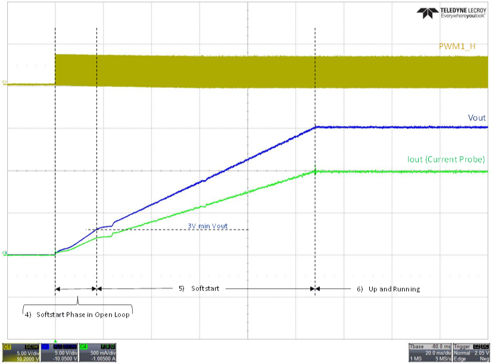

 

--- 
# dsPIC33 Four Switch Buck-Boost Converter 
### 4-Switch Buck-Boost Converter: Voltage Mode Control

<a target="_blank" href="https://www.microchip.com/developmenttools/ProductDetails/PartNO/EV44M28A" rel="nofollow">
dsPIC33 4-Switch Buck-Boost Converter
</a>

- - -

## Table of Contents
  - [How to use this document](#how-to-use-this-document)
  - [Summary](#summary)
  - [Related Collateral](#related-collateral)
    - [Software Used](#software-used)
    - [Hardware Used](#hardware-used)
  - [Quick-start Guide](#quick-start-guide)
    - [Basic Hardware Setup](#basic-hardware-setup)
    - [Setting up and connecting the board power visualizer](#setting-up-and-connecting-the-board-power-visualizer)
    - [Running Closed Loop with Poti Reference](#running-closed-loop-with-poti-reference)
    - [Running Closed Loop with a Fixed Reference](#running-closed-loop-with-a-fixed-reference)
    - [Running Closed Loop with GUI Reference](#running-closed-loop-with-gui-reference)
  - [Control Method](#control-method)
  - [Converter State Machine Overview](#converter-state-machine-overview)
    - [Start-up](#start-up)
    - [Fault Handler](#fault-handler)
    - [State 1: Initialization](#state-1-initialization)
    - [State 2: Fault Active](#state-2-fault-active)
    - [State 3: Standby](#state-3-standby)
    - [State 4: Soft-start in Open Loop](#state-4-soft-start-in-open-loop)
    - [State 5: Soft-start (closed loop)](#state-5-soft-start-closed-loop)
    - [State 6: Up and Running](#state-6-up-and-running)
    - [More Details on Start-up](#more-details-on-start-up)
  - [Plant Frequency Response Simulation with MPLAB® Mindi™](#plant-frequency-response-simulation-with-mplab-mindi)
  - [Importing Plant Frequency Response into DCDT](#importing-plant-frequency-response-into-dcdt)
- - -
## How to use this document
This document is intended as a supplement to the user's guide. We recommend that the user's guide is studied before reading this document. 
The user's guide can be found [here.](https://www.microchip.com/developmenttools/ProductDetails/PartNO/EV44M28A).

- - -
## Summary
This solution demonstrates the implementation of a 4-switch buck-boost converter  using voltage mode control on the Four-Switch Buck-Boost Development Board (4SWBB).
This power board is a generic development board for this topology that supports rapid prototyping and code development based on dsPIC33 devices. The board provides organized building blocks that include an input filter, power stage, AUX supply, mating socket for Microchip’s newest Digital Power
Plug-In Modules (DP-PIMs), Human Machine Interface (HMI) and test points. The
electrical characteristics are applicable to automotive requirements and can be used for these applications as well. For example, input power can be a standard 12V vehicle power rail and operate within the automotive ambient temperature range. A mating socket for dsPIC33 Plug-In Modules allows the system to be evaluated with different controllers. The pin-out is compatible for EP, CK and CH dsPIC® DSC DP PIMs.

The associated firmware uses voltage mode control to regulate the output voltage. The input voltage range is 8V to 18V, and the output voltage range is 5V to 20V. It can run without external cooling up to 20W and 2A at the output.

The firmware also includes a scheduler to allow the user to easily add their own housekeeping functions. In our example code, the scheduler executes drivers for the Human Machine Interface (HMI) and for communication with the Board Power Visualizer GUI.

- - -
## Related Collateral

The related documentation can be found on the appropriate product website
- [Four-Switch Buck-Boost Development Board](https://www.microchip.com/developmenttools/ProductDetails/PartNO/EV44M28A)
- [dsPIC33CK256MP508 Family Data Sheet](https://www.microchip.com/70005349)
- [dsPIC33CK256MP508 Family Silicon Errata and Data Sheet Clarification](https://www.microchip.com/80000796)

Please always check for the latest data sheets on the respective product websites:
- [dsPIC33CK256MP508 Family](https://www.microchip.com/dsPIC33CK256MP508)
- [dsPIC33CH512MP508 Family](https://www.microchip.com/dsPIC33CH512MP508)

### Software Used
- [Power Board Visualizer GUI](https://www.microchip.com/SWLibraryWeb/product.aspx?product=POWER_BOARD_VISUALIZER)
- [MPLAB&reg; X IDE v5.45](https://www.microchip.com/mplabx-ide-windows-installer)
- [MPLAB&reg; XC16 Compiler v1.61](https://www.microchip.com/mplabxc16windows)
- [Microchip Code Configurator v4.0.2](https://www.microchip.com/mplab/mplab-code-configurator)
- [Digital Compensator Design Tool](https://www.microchip.com/developmenttools/ProductDetails/DCDT)
- [MPLAB&reg; Mindi™ Simulator](https://www.microchip.com/SWLibraryWeb/producttc.aspx?product=AnalogSimMPLABMindi)

### Hardware Used
- Four-Switch Buck-Boost Development Board, Part-No. [EV44M28A](https://www.microchip.com/developmenttools/ProductDetails/PartNO/EV44M28A)
- dsPIC33CK256MP506 Digital Power PIM, Part-No. [MA330048](https://www.microchip.com/MA330048)

---

## Quick-start Guide
In this section, we describe step by step how to run the firmware on the power board. We also describe how to interface with the board power visualizer GUI.
 
 
### Basic Hardware Setup 

Connect the DP-PIM to the power board. Then connect the ICD4 debugger to the 6-pin header on the DP-PIM via the RJ11 cable and the RJ11 to ICSP adapter. Finally, connect a USB cable between the micro-USB port on the top-right of the DP-PIM and your computer - for this you will require a type A to micro-USB type B cable.

  

    
     
    Connections from DP-PIM and power board to computer
  

The firmware provides the capability for a potentiometer to provide the output voltage reference. We recommend using the facility the first time you bring up the board.
The potentiometer needs to be connected to the 6-pin header on the edge of the power board, as shown below.

  

    
     
    Connecting a potentiometer to the power board, to provide the voltage set-point
  

There is an 8:1 resistive divider on the power board between the converter output terminals and the dsPIC pin at which the output voltage is sensed at. Hence, if the potentiometer is used to provide the voltage loop reference, in closed loop operation the output voltage = (Voltage at pin 2 of header) * 8.

At start-up, the firmware detects if a potentiometer is present, and if so, uses the voltage on pin 2 of the header as the reference for the voltage loop compensator. If no potentiometer is sensed, then the default set-point is fixed to get 12V at the output terminals.

For first board bring up, set the potentiometer wiper to get the lowest possible voltage on pin 2 of the header.

Next, connect a voltage source to the input terminals and a load to the output terminals as shown below. For first board bring-up, set Vin=12V and use either a constant current load of around 300mA, or a resistive load of approximately 40R. The output voltage can be probed at test point TP340, which is located at the top right of the board. Once the converter is up and running, you can change these values.

  

    
     
    Connecting a source and a load to the power board
  

Next, follow the instructions in the user’s guide to program the dsPIC via MPLABx.

At this point, the code should be running on the dsPIC without any input voltage or load. You should now check the status LEDs on the power board and DP-PIM (for more information on the status LEDs, please refer to the user’s guide).

  

    
     
    Status LEDs with firmware running
  

 
 

### Setting up and connecting the board power visualizer  

 

Open board power visualizer on your computer. On the window that appears, click "Open Project", and then navigate to the "gui" folder (the "gui" folder is at the same level as this README.md file). Select "4SWBB", and the window below will open.

  

    
     
    Board power visualizer window for 4SWBB
  

More information about the items in the status window is shown below. On the left are the "signal" channels, to the right there are buttons and a slider to control the output voltage reference source and value. On the right, the controller state, fault flags and status flags are shown.

  

    
     
    Board power visualizer status window
  

There are a number of other tabs on the top of the screen, you can click on these to find out more, they are pretty self-explanatory hence we don't go into much detail on tabs in this document.

  

    
     
    Board power visualizer tabs
  

 
Now you need to pair the GUI with the firmware running on the dsPIC.
To do this, click on the "COM?" button, select the port and speed (the speed should default to the correct value of 115200), then click on the "Enable" button.
 
 
If the communications channel is working, you should see the "Communications status" button on the bottom left of the status window flashing alternately green and red. The status window should show around 12V on Vdd, the converter state should be "standby" and the "Open loop" flag should be asserted.

  

    
     
    GUI status window at start-up
  

To start running the converter, short press the "USER" button on the power board.

  

    
     
    Starting the converter
  

The converter is now running "open loop". This means that the duty cycle is set directly based on the potentiometer voltage. The voltage loop compensator output is ignored in open loop mode. 

 

At this point 

* The green LED on the power board should be permanently on.
* The Red LED on the power board should be slow blinking.

Going back to the GUI screen, you should see the following:

  

    
     
    GUI status window with converter running open loop, with poti reference
  

To change the output voltage, move the poti wiper. 
 
 

 ### Running Closed Loop with Poti Reference
  

* Short press the "USER" button on the power board.  
    * This turns off the converter.
    * "Ctrl-State" on the GUI should be "Standby".
* Long press the "USER" button: this changes to "closed loop" mode.
    * Poti voltage provides reference to compensator.
    * Compensator drives duty cycle.
* Set potentiometer wiper to get minimum voltage on pin 2 of 6 pin header.

  

    
     
    GUI status window with converter in standby, closed loop mode
  

* Short press the "USER" button on the power board.
    * This turns on the converter.
    * "Ctrl-State" on the GUI should be "Running".

  

    
     
    GUI status window with converter running in closed loop mode
  

* Observe the LEDs on the power board.
    * Green LED should be permanently on.
    * Red LED should be off.

The converter is now running in closed loop mode. This means that the potentiometer output is providing the reference to the compensator, and the output of the compensator drives the duty cycle.

Move the potentiometer wiper to change the voltage loop reference and thus the output voltage.  

 

 ### Running Closed Loop with a Fixed Reference
  
 To run the firmware with a fixed internal reference, disconnect the potentiometer from the power board and re-start the firmware. At start-up, the firmware checks for the presence of the potentiometer. If the firmware determines that no potentiometer is connected, it used a fixed internal reference that corresponds to an output voltage of 12V. In this case, you will see that the "Fixed Ref" flag will be on.
 

  

    
     
    Fixed Ref flag in GUI status window
  

To run closed-loop with a fixed reference:
* Long press "USER" button to change from open loop mode to closed loop mode.
* Short press "USER" button to run converter.

At this point, there should be 12V at the output. You can short-press the "USER" button to turn on/off the converter.   
 
 

### Running Closed Loop with GUI Reference

 

Configure the converter to run in closed loop mode. To use the GUI programmable reference, either click on the "Update Ref value" button on the GUI or click on the "Update" button on the slider. You can select the output voltage using the slider. The "GUI Ref" flag should be on when the GUI reference is active.

  

    
     
    Using GUI output voltage reference
  

At this point, You can try different combinations of input voltages, output voltages and loads. Note that the converter can operate safely to a max output power of 20W, and max output load current of 2A.

---

## Control Method

This version of the 4-switch buck-boost firmware uses Voltage Mode Control (VMC). The user's guide concentrates on the firmware release that uses average current mode control, hence we thought it apt to add supplementary information here for this (voltage mode control) version.

In VMC the output voltage is divided and digitized, then compared against a reference in the firmware. The difference between the two, the "error", is passed through a digital compensator. The output of the compensator is an integer that is proportional to the duty cycle, and this drives the pulse width modulator (PWM). 

  

    
     
    Voltage mode Control
  

On the hardware, the voltage divider ratio is 8:1, as shown below.

  

    
     
    Feedback network from Vout to ADC input
  

The feedback path from the output terminals to the ADC input is an analog signal. It is digitized with the ADC on the dsPIC. the ADC has 12-bits of resolution and a reference of 3.3V. The compensator reference value needs to be normalized to have the same scaling as the feedback signal. For example, the integer in the firmware used to represent a 12V reference as seen at the output terminals is calculated as

  

    
     
    Converting reference to an integer
  

  
Thus, the digitized feedback signal (an integer) is subtracted from the reference (also an integer) and passed through the digital compensator. The output of the compensator is a number that is proportional to the duty cycle. This number is used to drive the PWM peripheral of the dsPIC, the output of which drives the FET drivers ICs which drive the 4 FETs.
  
  
The loop response is shown below, for Vin = 8V, Vout = 20V and Pin = 20W, using a 2 pole 2 zero (2P2Z) compensator. Note that the crossover frequency is 1.7kHz, the phase margin is 50 degrees and the gain margin is 19 dB.
This shows that this voltage mode controller does not need any current information to get a stable output voltage. Input current sensor and output current sensors on the demo board are only used for fault and safety handling.

  

    
     
    Bode plot, Voltage mode control, 2 pole 2 zero compensator
  

  

The demo firmware can be configured to use a type 2 compensator (2P2Z) and can also be configured to use a type 3 (3P3Z) compensator. See below, where under the same operating conditions, the loop response is measured with a 3P3Z compensator and a 2P2Z compensator. The cross-over frequencies are the same, but you can get more phase at high frequencies with the 3P3Z compensator. Also note that the gain with the 3P3Z compensator doesn't roll off as quickly at higher frequencies, this could be problematic under certain operating conditions.

  

    
     
    Bode plot, Voltage mode control, different compensators
  

  

---

## Converter State Machine Overview

Some supplementary information on the converter state machine is given here.
The converter state machine is run every 100us.

A brief description of each state is given in this section. 

  

    
     
    Converter state machine
  

 

### Start-up
* The PWM is initialized
  * the PWM outputs are disabled but the PWM modules are running internally to trigger the ADC ISR.
  * This is important as all signal measurements are based upon the ADC ISR.

### Fault Handler

* The fault handler is called every 100us, just before the state machine is executed. 

### State 1: Initialization

* The fault counters for Vin under-voltage and over-voltage are set. 
* Done here to enable Vin faults when auxiliary power is driven via USB connected to the DP-PIM.

### State 2: Fault Active
* Stays here until all fault conditions are cleared.

### State 3: Standby
* PWM is active, and the control mode (open loop or closed loop) is saved. 
* Force switch to open loop mode
  * means that compensator does not drive the duty cycle.
  * instead, the voltage loop demand directly drives the duty cycle. 
  * At this point, the voltage loop demand is set to 0, which corresponds to minimum duty cycle.

### State 4: Soft-start in Open Loop
* Duty cycle is increased linearly until Vout >= 3V.  
* The saved control mode (open or closed loop) from state 3 is then restored. 
* Voltage compensator initialized with preloaded value for controller output.
  * Ensures a smooth start to the soft-start ramp. 

### State 5: Soft-start (closed loop)
* Voltage loop reference ramped linearly to give a fixed soft-start time under all conditions.

### State 6: Up and Running
* Converter is running, and conditions based on flags are checked. 
* Faults and HMI inputs can cause state change, depending on converter status.

### More Details on Start-up
Additional information on the start-up characteristic is shown below.

  

    
     
    Start-up characteristic
  

 
We start off in open loop mode with minimum duty cycle: this means that the duty cycle is directly proportional to the voltage loop reference (the compensator output is ignored). The duty is slowly increased until the output voltage reaches 3V. When Vout >= 3V, the duty cycle is saved and used as the new buck minimum duty cycle. The converter then switches to closed loop mode and the voltage loop reference is ramped linearly until it hits its target value. 

---

## Plant Frequency Response Simulation with MPLAB® Mindi™
Mindi™ is the Microchip-branded demo version of Simplis/SiMetrix. It supports the common features of the Simplis Standard License but limits the number of circuit nodes. 
A model of the 4SWBB plant is available with this deployment.
To open the file in Mindi, select File -> Open, and navigate to 4swbb_01_using_generic_PWM_with_ACanalysis.wxsch.

  

    
     
    Plant model in Simplis
  

 
The model is setup to simulate the frequency response of the plant at a particular DC operating point. 

The output of the PWM generation blocks on the bottom of the Mindi file generate a steady-state duty cycle (controlled by the DC source V4) superimposed with a small amount of AC jitter (controlled by the AC source V2). During the frequency response analysis, the frequency of the AC source V2 is swept from 100Hz to 200kHz. 

By default, the input voltage is set to 8V and the duty is set to get an output voltage of 20W. These can be changed to simulate the response at different operating points.

The POP (Periodic Operating Point) trigger is required to tell the simulator when each switching cycle starts, hence it needs to be placed on an appropriate node - here it is placed on the buck switching node. 

The bode plot probes measure the gain and phase of the plant frequency response, both for the current and voltage.

To check the simulator settings, select Simulator -> Choose Analysis.

To run the simulation, select Simulator -> Run Schematic.

To save the results in .csv format, click on the results window, then click "Edit -> Copy ASCII data"

---

## Importing Plant Frequency Response into DCDT

The Digital Compensator Design Tool (DCDT) helps power supply designers by simplifying the overall process of determining the digital compensator coefficients and analyzing the control system performance. The DCDT incorporates all feedback gains and delays to provide the most accurate model of the control system. 
Measurements of the plant frequency response can be imported into DCDT to help with the process of compensator design. 

As an example, we have included a such a plant measurement taken using this development board, at Vin = 8V and Vout = 20V. The data needs to be in a .csv file. This file can be found in the directory "plant" and is called "BodePlant Vin 8V Vout 20V 20W.csv".

To import this data into DCDT, open MPLABx, then click Tools -> Embedded -> Digital Compensator Design Tool.

In the window that appears, click "Open".

  

    
     
    DCDT window
  

 
In the next window, click "Plant"

  

    
     
    Plant selection in DCDT
  

 
Then click "Chooser" on the bottom right of the window.
Then click "Import".
Then import the file, clicking on the icon as shown below, and navigating to the "plant" directory, then selecting the file "BodePlant Vin 8V Vout 20V 20W.csv"

  

    
     
    Importing plant measurements into DCDT
  

 

You can plot the plant gain and phase measurements in DCDT by checking the "plant" checkbox as shown below. The plant measurement can now be used to help you to design your compensator to achieve the performance that you require.

  

    
     
    Plotting imported plant measurements
  

 

Note that the "feedback gain" setting in DCDT for both the 2P2Z and 3P3Z projects is set to 0.014. 

  

    
     
    Feedback gain setting in DCDT
  

 

This value is correct for this development board and considers all gains in the system. It means that if the plant is measured and imported, the tool can be used to combine the compensator and plant response to estimate the closed-loop frequency response.

---

&copy; 2021, Microchip Technology Inc.
